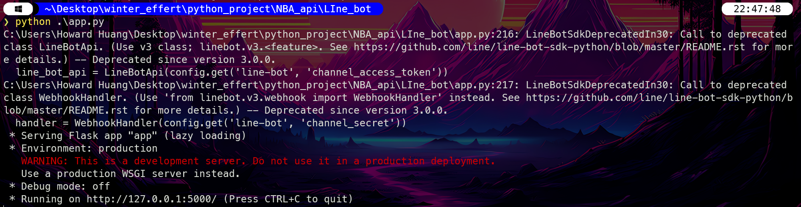
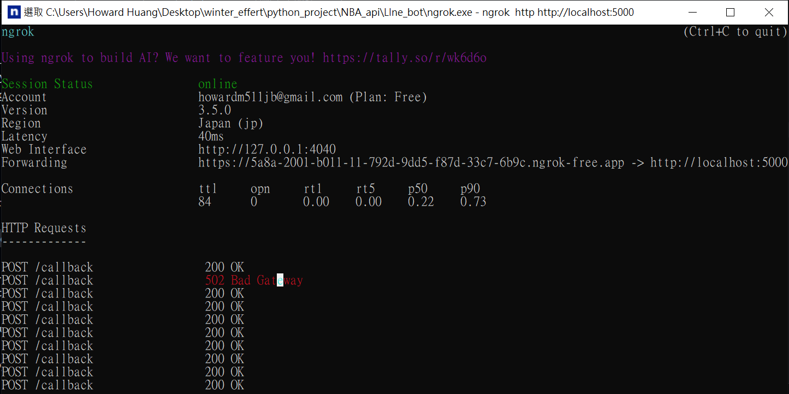
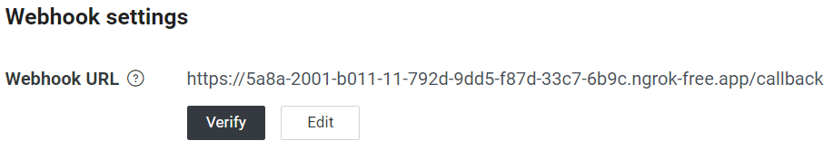

# Line bot 傳送 nba 賽程


## Step0 environment setup:
1. 下載 lins-bot 和 nba_api packages

<!-- <pre id="codeBlock">
<code>
pip install line-bot-sdk  <button onclick="copyText()">copy</button>
</code>
</pre>

<script>
function copyText() {
  const text = document.getElementById('codeBlock').innerText;
  navigator.clipboard.writeText(text).then(() => {
    alert('copied');
  }, (err) => {
    console.error('can not copy: ', err);
  });
}
</script> -->
```BASH
pip install line-bot-sdk
```

<!-- <pre id="codeBlock">
<code>
pip install nba_api  <button onclick="copyText()">copy</button>
</code>
</pre>

<script>
function copyText() {
  const text = document.getElementById('codeBlock').innerText;
  navigator.clipboard.writeText(text).then(() => {
    alert('copied');
  }, (err) => {
    console.error('can not copy: ', err);
  });
}
</script> -->
```BASH 
pip install nba_api
```

2. 到 line developer 官網 create providers   [Line Developers](https://developers.line.biz/console/channel/2003346798/messaging-api)

3. 複製並保管 channel_access_token 和 channel_secret


## Step1 運行範例 app.py:
```BASH
python app.py
```

查看是用到 local 的哪個 port




## Step2 資料夾中開啟 ngrok.exe:
0. 到官網下載，並註冊 https://dashboard.ngrok.com/get-started/setup/windows

1. 輸入開啟憑證 
```bash
ngrok config add-authtoken 2WWIi7m5tNf0jRbKPJYUrb3wRw0_3KMjEwGzhMm3VLwZnQKj3 
```

2. 輸入想連的local port:
```bash
ngrok http http://localhost:5000
```



## Step3 檢查 Line Webhook:
記得要在網址後方加上 app.py router 的內容



verify 正確的話就成功了


## Source:
1. [[Python Linebot]教你如何使用Python成功串接Linebot(2020版)](https://ithelp.ithome.com.tw/articles/10229943)

2. [發送 LINE Notify 通知](https://steam.oxxostudio.tw/category/python/spider/line-notify.html#google_vignette)

3. [[Day-37] 使用 ngrok 讓外網連接你的 API](https://ithelp.ithome.com.tw/articles/10197345)

4. [line bot教學：專家傳授聊天機器人精準、極速開發法｜Live講堂](https://www.youtube.com/watch?v=lY74e2_Z3Vw)

5. [line-bot-sdk-python GitHub](https://github.com/line/line-bot-sdk-python)